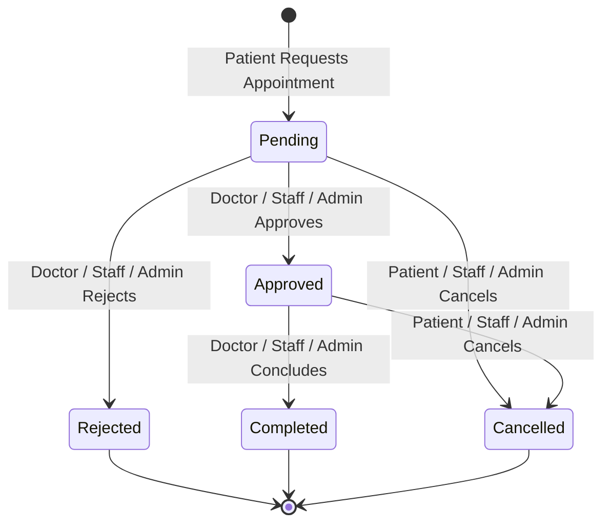

# Hospital Management System – Web Application

[](https://github.com/Vikas-TK/CI-CD/actions/workflows/ci.yml)
[](https://github.com/Vikas-TK/CI-CD/actions/workflows/cd.yml)
[](https://www.python.org/)
[](https://flask.palletsprojects.com/)
[](https://www.mysql.com/)

> **Academic Project Note**: This project is developed as an individual academic demonstration of a modular, secure Hospital Management System (HMS) with role-based access control and Continuous Integration / Continuous Deployment (CI/CD) using GitHub Actions. It is not a certified medical software product and must not be used with real-world patient records without regulatory compliance and operational certification.

---

## 1. Project Overview & Scope

The **Hospital Management System (MediCare HMS)** is a web-based enterprise application built to streamline and unify healthcare operations across hospital departments. The system transitions an initial modular Python console design into a modern web application featuring:

- **Strict Server-Side Role-Based Access Control (RBAC)** across 5 distinct hospital personas: **Administrator**, **Doctor**, **Staff**, **Patient**, and **Pharmacy Manager**.
- **Secure Authentication and Session Lifecycle Management** utilizing Flask-Login, Werkzeug password hashing (scrypt), and CSRF protection.
- **Enterprise CI/CD Automation** powered exclusively by **GitHub Actions** (no Jenkins), integrating linting, automated testing with JUnit XML reporting, SonarCloud quality gates, and containerized staging/production deployment.

---

## 2. Implemented Modules

### 2.1 Module 1: User Authentication & Role Management
- **Patient Self-Registration**: Public portal registration strictly assigns the `PATIENT` role with input validation for email format, phone syntax, and password matching.
- **Multi-Identifier Login**: Authenticates via either **Email Address** or **Phone Number** against secure Werkzeug password hashes.
- **Session Management**: Session persistence, remember-me options, timeout controls, and logout.
- **Role-Based Redirection & Protection**: Dedicated dashboards for Administrator, Doctor, Staff, Patient, and Pharmacy Manager.
- **Privileged Account Creation**: Privileged accounts (`DOCTOR`, `STAFF`, `PHARMACY_MANAGER`, `ADMINISTRATOR`) can only be provisioned by authenticated Administrators or initialized via the secure CLI command.
- **Administrator User Management**: Search/filter users, toggle active status with self-deactivation protection, and modify roles with self-demotion protection.
- **Health Check Endpoint**: `/health` JSON probe for CI/CD and container monitoring.

### 2.2 Module 2: Patient Management
- **1-to-1 User Profile Association**: Unique link to `PATIENT` user (`users.user_id`), keeping core identification normalized in `users`.
- **Self-Service Profile Lifecycle**: Profile completion prompt and editing of allowed demographic fields.
- **Privacy & Aadhaar Masking**: Aadhaar numbers (12 digits) masked in standard format `XXXX-XXXX-1234` across UI views.
- **Role-Based Patient Directory**: Admin management, Doctor read-only consultation directory, Staff patient intake registry.

### 2.3 Module 3: Doctor Management
- **Controlled Account Provisioning**: Provisioning restricted to Administrator or CLI commands; public doctor registration blocked.
- **1-to-1 Doctor Profile Association**: Links to `DOCTOR` user (`users.user_id`) with medical specialization tracking.
- **Doctor Self-Service**: Doctor profile view (`/doctor/profile`) and specialization/phone update (`/doctor/profile/edit`).
- **Hospital Doctor Directory**: Public/hospital-wide search (`/doctors`) by name and specialization filter.

### 2.4 Module 4: Patient–Doctor Appointment Management
- **Conflict-Free Scheduling Engine**: Double-booking prevention on same date and time slot for active appointments (`Pending`, `Approved`).
- **Date & Time Validation**: Past dates and invalid time formats rejected.
- **State Machine Transitions**: Patient request/cancel, Doctor approve/reject/complete with clinical notes, Admin/Staff hospital-wide management.



### 2.5 Module 5: Staff Management
- **Controlled Staff Provisioning**: Only authenticated Administrators can create/manage `STAFF` accounts and assign job designations (`Nurse`, `Receptionist`, `Lab Technician`, `Pharmacist Assistant`, `Ward Assistant`, `Accountant`, `Administrative Staff`, `Other`).
- **1-to-1 Staff Profile Association**: Normalized `staff` table linked to `users.user_id` with role validation (`role == "STAFF"`).
- **Administrator Staff Management**:
  - Full staff directory (`/admin/staff`) with search (by Name, Email, Phone, Designation, Staff ID) and filters (Designation, Status).
  - Provision staff account + profile atomically (`/admin/staff/create`) or link unprofiled staff user.
  - Detailed staff profile view (`/admin/staff/<id>`) and edit interface (`/admin/staff/<id>/edit`).
  - Unprofiled staff user alert banner.
- **Staff Self-Service**:
  - Authenticated staff members view their own profile on `/staff/profile`.
  - Staff members update allowed fields (phone number, Aadhaar number) on `/staff/profile/edit`.
  - Designation and Staff ID remain admin-controlled; role tampering and accessing other staff profiles is strictly blocked.
- **Staff Directory**:
  - Hospital-wide staff directory (`/staff`) with search and designation filters.
  - Aadhaar numbers are **never exposed** in the general staff directory.

---

## 3. Technology Stack

- **Backend**: Python 3.10+, Flask 3.x, Flask-SQLAlchemy, Flask-Migrate, Flask-Login, Flask-WTF, Werkzeug.
- **Frontend**: HTML5, CSS3, JavaScript (Fetch API), Bootstrap 5.3, Bootstrap Icons, Google Fonts (Inter).
- **Database**: MySQL 8.0 (production & development), In-Memory SQLite (isolated automated testing).
- **CI/CD & Code Quality**: GitHub Actions, SonarCloud / SonarQube, Flake8, pytest, pytest-cov.
- **Containerization**: Docker, Gunicorn WSGI.

---

## 4. Database Schema Design

### 4.1 `users` Table
| Column Name | Data Type | Constraints | Description |
|---|---|---|---|
| `user_id` | `INTEGER` | `PRIMARY KEY, AUTO_INCREMENT` | Unique user identifier |
| `first_name` | `VARCHAR(50)` | `NOT NULL` | User's first name |
| `last_name` | `VARCHAR(50)` | `NOT NULL` | User's last name |
| `email` | `VARCHAR(120)` | `NOT NULL, UNIQUE, INDEX` | Login identifier & contact |
| `phone_number` | `VARCHAR(20)` | `NOT NULL, UNIQUE, INDEX` | Login identifier & phone |
| `password_hash`| `VARCHAR(255)` | `NOT NULL` | Werkzeug scrypt hash |
| `role` | `VARCHAR(30)` | `NOT NULL, INDEX` | `ADMINISTRATOR`, `DOCTOR`, `STAFF`, `PATIENT`, `PHARMACY_MANAGER` |
| `is_active` | `BOOLEAN` | `NOT NULL, DEFAULT TRUE` | Active account status flag |
| `created_at` | `DATETIME` | `NOT NULL` | Account creation timestamp (UTC) |
| `updated_at` | `DATETIME` | `NOT NULL` | Last update timestamp (UTC) |

### 4.2 `patients` Table
| Column Name | Data Type | Constraints | Description |
|---|---|---|---|
| `patient_id` | `INTEGER` | `PRIMARY KEY, AUTO_INCREMENT` | Unique patient profile ID |
| `user_id` | `INTEGER` | `NOT NULL, UNIQUE, FOREIGN KEY (users.user_id) ON DELETE CASCADE` | 1-to-1 link to user account |
| `age` | `INTEGER` | `NULLABLE` | Patient age (0–130) |
| `gender` | `VARCHAR(20)` | `NULLABLE` | Gender identity |
| `aadhaar_number` | `VARCHAR(20)` | `NULLABLE` | 12-digit Indian national identity number |
| `blood_group` | `VARCHAR(10)` | `NULLABLE` | Blood group (`A+`, `A-`, `B+`, `B-`, `AB+`, `AB-`, `O+`, `O-`) |
| `disease_or_complaint` | `TEXT` | `NULLABLE` | Medical complaint / symptoms |
| `emergency_contact_name` | `VARCHAR(100)` | `NULLABLE` | Emergency contact person name |
| `emergency_contact_phone`| `VARCHAR(20)` | `NULLABLE` | Emergency contact phone number |
| `address` | `VARCHAR(255)` | `NULLABLE` | Residential address |
| `created_at` | `DATETIME` | `NOT NULL` | Record creation timestamp (UTC) |
| `updated_at` | `DATETIME` | `NOT NULL` | Record last updated timestamp (UTC) |

### 4.3 `doctors` Table
| Column Name | Data Type | Constraints | Description |
|---|---|---|---|
| `doctor_id` | `INTEGER` | `PRIMARY KEY, AUTO_INCREMENT` | Unique doctor profile ID |
| `user_id` | `INTEGER` | `NOT NULL, UNIQUE, FOREIGN KEY (users.user_id) ON DELETE CASCADE` | 1-to-1 link to doctor user |
| `specialization` | `VARCHAR(100)` | `NOT NULL` | Clinical specialization |
| `created_at` | `DATETIME` | `NOT NULL` | Record creation timestamp (UTC) |
| `updated_at` | `DATETIME` | `NOT NULL` | Record last updated timestamp (UTC) |

### 4.4 `staff` Table
| Column Name | Data Type | Constraints | Description |
|---|---|---|---|
| `staff_id` | `INTEGER` | `PRIMARY KEY, AUTO_INCREMENT` | Unique staff profile ID |
| `user_id` | `INTEGER` | `NOT NULL, UNIQUE, FOREIGN KEY (users.user_id) ON DELETE CASCADE` | 1-to-1 link to staff user |
| `designation` | `VARCHAR(100)` | `NOT NULL` | Staff role (`Nurse`, `Receptionist`, etc.) |
| `aadhaar_number` | `VARCHAR(20)` | `NULLABLE` | Optional 12-digit Indian national identity number |
| `created_at` | `DATETIME` | `NOT NULL` | Record creation timestamp (UTC) |
| `updated_at` | `DATETIME` | `NOT NULL` | Record last updated timestamp (UTC) |

### 4.5 `appointments` Table
| Column Name | Data Type | Constraints | Description |
|---|---|---|---|
| `appointment_id` | `INTEGER` | `PRIMARY KEY, AUTO_INCREMENT` | Unique appointment ID |
| `patient_id` | `INTEGER` | `NOT NULL, FOREIGN KEY (patients.patient_id) ON DELETE CASCADE, INDEX` | Foreign key to patient |
| `doctor_id` | `INTEGER` | `NOT NULL, FOREIGN KEY (doctors.doctor_id) ON DELETE CASCADE, INDEX` | Foreign key to doctor |
| `appointment_date` | `DATE` | `NOT NULL, INDEX` | Scheduled consultation date |
| `appointment_time` | `TIME` | `NOT NULL` | Scheduled consultation time |
| `reason_for_visit` | `TEXT` | `NOT NULL` | Patient symptoms / consultation complaint |
| `status` | `VARCHAR(20)` | `NOT NULL, INDEX, DEFAULT 'Pending'` | `Pending`, `Approved`, `Rejected`, `Cancelled`, `Completed` |
| `review_notes` | `TEXT` | `NULLABLE` | Clinical remarks or cancellation reasons |
| `created_at` | `DATETIME` | `NOT NULL` | Booking creation timestamp (UTC) |
| `updated_at` | `DATETIME` | `NOT NULL` | Status update timestamp (UTC) |

---

## 5. Application Route Access Matrix

| Route Endpoint | HTTP Methods | Allowed Personas | Purpose |
|---|---|---|---|
| `/` | `GET` | Public | Landing page & hospital overview |
| `/health` | `GET` | Public | Health probe for Docker/CI/CD |
| `/doctors` | `GET` | Public | Medical specialists directory |
| `/staff` | `GET` | Public | Hospital staff directory (no Aadhaar) |
| `/auth/login` | `GET, POST` | Public | Multi-identifier user login |
| `/auth/register` | `GET, POST` | Public | Patient self-registration |
| `/auth/logout` | `GET` | Authenticated | Session invalidation |
| `/admin/dashboard` | `GET` | Administrator | System KPI & overview |
| `/admin/users` | `GET` | Administrator | User directory & filter |
| `/admin/users/create` | `POST` | Administrator | Privileged account provisioning |
| `/admin/users/<id>/toggle-status` | `POST` | Administrator | Account activation/deactivation |
| `/admin/users/<id>/change-role` | `POST` | Administrator | User role modification |
| `/admin/patients` | `GET` | Administrator | Patient management directory |
| `/admin/patients/<id>` | `GET` | Administrator | Detailed patient profile view |
| `/admin/patients/<id>/edit` | `GET` | Administrator | Patient edit form |
| `/admin/patients/<id>/update` | `POST` | Administrator | Update patient details |
| `/admin/doctors` | `GET` | Administrator | Doctor management directory |
| `/admin/doctors/create` | `GET, POST` | Administrator | Provision doctor account + profile |
| `/admin/doctors/<id>` | `GET` | Administrator | Detailed doctor profile view |
| `/admin/doctors/<id>/edit` | `GET` | Administrator | Doctor edit form |
| `/admin/doctors/<id>/update` | `POST` | Administrator | Update doctor profile |
| `/admin/staff` | `GET` | Administrator | Staff management directory |
| `/admin/staff/create` | `GET, POST` | Administrator | Provision staff account + profile |
| `/admin/staff/<id>` | `GET` | Administrator | Detailed staff profile view |
| `/admin/staff/<id>/edit` | `GET` | Administrator | Staff edit form |
| `/admin/staff/<id>/update` | `POST` | Administrator | Update staff profile |
| `/admin/appointments` | `GET` | Administrator | Hospital appointment schedule |
| `/admin/appointments/<id>` | `GET` | Administrator | Appointment details |
| `/admin/appointments/<id>/status` | `POST` | Administrator | Update appointment status |
| `/doctor/dashboard` | `GET` | Doctor | Doctor operational portal |
| `/doctor/profile` | `GET` | Doctor | Doctor self-service profile |
| `/doctor/profile/edit` | `GET` | Doctor | Doctor self-service edit form |
| `/doctor/profile/update` | `POST` | Doctor | Update specialization & phone |
| `/doctor/patients` | `GET` | Doctor | Read-only clinical patient directory |
| `/doctor/patients/<id>` | `GET` | Doctor | Read-only clinical patient chart |
| `/doctor/appointments` | `GET` | Doctor | Doctor consultation queue |
| `/doctor/appointments/<id>` | `GET` | Doctor | Consultation sheet & actions |
| `/doctor/appointments/<id>/status` | `POST` | Doctor | Approve/Reject/Complete appointment |
| `/staff/dashboard` | `GET` | Staff | Staff operational portal |
| `/staff/profile` | `GET` | Staff | Staff self-service profile |
| `/staff/profile/edit` | `GET` | Staff | Staff self-service edit form |
| `/staff/profile/update` | `POST` | Staff | Update phone & Aadhaar |
| `/staff/patients` | `GET` | Staff | Read-only patient intake directory |
| `/staff/patients/<id>` | `GET` | Staff | Read-only patient record |
| `/staff/appointments` | `GET` | Staff | Hospital appointment schedule |
| `/staff/appointments/<id>` | `GET` | Staff | View appointment details |
| `/staff/appointments/<id>/status` | `POST` | Staff | Update appointment status |
| `/patient/dashboard` | `GET` | Patient | Patient portal & appointment overview |
| `/patient/profile` | `GET` | Patient | Patient medical profile |
| `/patient/profile/edit` | `GET` | Patient | Patient self-service edit form |
| `/patient/profile/update` | `POST` | Patient | Update permitted demographic fields |
| `/patient/profile/complete` | `GET, POST` | Patient | Initial profile onboarding |
| `/patient/appointments` | `GET` | Patient | Personal appointment history |
| `/patient/appointments/request` | `GET, POST` | Patient | Book consultation with doctor |
| `/patient/appointments/<id>` | `GET` | Patient | View appointment status & notes |
| `/patient/appointments/<id>/cancel` | `POST` | Patient | Cancel pending/approved appointment |
| `/pharmacy/dashboard` | `GET` | Pharmacy Manager | Pharmacy inventory portal |

---

## 6. Installation & Local Setup

### 6.1 Prerequisites
- Python 3.10+
- MySQL Server 8.0+ (or Docker)
- Git

### 6.2 Clone the Repository
```bash
git clone https://github.com/Vikas-TK/CI-CD.git
cd CI_CD
```

### 6.3 Set Up Python Virtual Environment
```bash
# Windows
python -m venv venv
venv\Scripts\activate

# Linux / macOS
python3 -m venv venv
source venv/bin/activate
```

### 6.4 Install Dependencies
```bash
pip install --upgrade pip
pip install -r requirements.txt
```

### 6.5 Environment Configuration
Copy `.env.example` to `.env` and configure your MySQL credentials:
```bash
cp .env.example .env
```
Sample `.env` contents:
```ini
FLASK_APP=run.py
FLASK_ENV=development
SECRET_KEY=your-secure-random-secret-key-32-chars-min
DB_HOST=localhost
DB_PORT=3306
DB_NAME=hospital_management_db
DB_USER=root
DB_PASSWORD=your_mysql_password
```

### 6.6 Initialize Database & Seed Demo Data
```bash
# Initialize tables
flask init-db

# Bootstrap Initial Administrator
flask create-admin --email admin@hospital.org --password AdminPassword123! --first-name System --last-name Admin --phone +1000000001

# Seed sample users, doctors, staff, patients, and appointments
flask seed-data
```

### 6.7 Run Development Server
```bash
flask run --port=5000 --debug
```
Access the application at `http://localhost:5000`.

---

## 7. Automated Testing & Code Quality

### 7.1 Run Pytest Test Suite
```bash
# Run all tests with coverage
pytest -v --cov=app --cov-report=term-missing

# Run with JUnit XML generation for CI
pytest -v --junitxml=test-results/junit.xml --cov=app --cov-report=xml:test-results/coverage.xml
```

### 7.2 Run Linting & Static Analysis
```bash
flake8 . --count --max-complexity=10 --max-line-length=127 --statistics
```

---

## 8. Continuous Integration & Continuous Deployment (CI/CD)

The project uses **GitHub Actions** exclusively (no Jenkins).

```
feature/module-5-staff-management
              |
              | Pull Request
              v
           develop
              |
              v
     ┌──────────────────┐
     │ GitHub Actions CI │
     ├──────────────────┤
     │ Checkout         │
     │ Python setup     │
     │ Install deps     │
     │ Flake8 Linting   │
     │ Pytest + JUnit   │
     │ SonarCloud Scan  │
     └────────┬─────────┘
              |
           SUCCESS
              |
              v
       STAGING DEPLOY
              |
              v
          Testing
              |
              v
             main
              |
              v
     ┌──────────────────┐
     │ GitHub Actions CD │
     ├──────────────────┤
     │ Build Container  │
     │ Health Check     │
     │ Deploy           │
     └────────┬─────────┘
              |
              v
        PRODUCTION
```

### 8.1 CI Workflow (`.github/workflows/ci.yml`)
- Triggers on push to `main`, `develop`, and `feature/**` branches, and on pull requests targeting `develop` and `main`.
- Matrix testing across Python 3.10 and 3.11.
- Flake8 linting and complexity checks (`--max-complexity=10`).
- Automated pytest execution generating JUnit XML and coverage XML artifacts.
- SonarCloud code quality and static analysis scanning.

### 8.2 CD Workflow (`.github/workflows/cd.yml`)
- Automatically triggers upon successful CI completion (`workflow_run`).
- **Develop branch** -> Deploys to `staging` environment with health verification.
- **Main branch** -> Deploys to `production` environment with health verification.
- Uses GitHub Environments (`staging`, `production`) and GitHub Secrets.

### 8.3 Required GitHub Secrets
Configure the following secrets in GitHub Repository Settings -> Secrets and Variables -> Actions:
- `SONAR_TOKEN`: Token from SonarCloud for code quality scanning.
- `SONAR_HOST_URL`: SonarQube/SonarCloud server URL (e.g. `https://sonarcloud.io`).
- `STAGING_SECRET_KEY`: Flask secret key for the staging environment.
- `PROD_SECRET_KEY`: Flask secret key for the production environment.
- `DATABASE_URL`: Production MySQL connection string.

---

## 9. Git Branching Strategy

- **`main`**: Production-ready code, deploys to production.
- **`develop`**: Integration branch, deploys to staging.
- **`feature/module-5-staff-management`**: Feature branch for Module 5 implementation.
