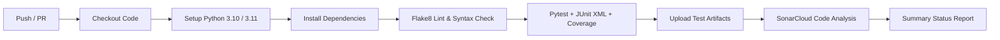

# Hospital Management System – Web Application

[](https://github.com/Vikas-TK/CI-CD/actions/workflows/ci.yml)
[](https://github.com/Vikas-TK/CI-CD/actions/workflows/cd-staging.yml)
[](https://www.python.org/)
[](https://flask.palletsprojects.com/)
[](https://www.mysql.com/)

> **Academic Project Note**: This project is developed as an individual academic demonstration of a modular, secure Hospital Management System (HMS) with role-based access control and Continuous Integration / Continuous Deployment (CI/CD) using GitHub Actions. It is not a certified medical software product and must not be used with real-world patient records without regulatory compliance and operational certification.

---

## 1. Project Overview & Scope

The **Hospital Management System (MediCare HMS)** is a web-based enterprise application built to streamline and unify healthcare operations across hospital departments. The system transitions an initial modular Python console design into a modern, web application featuring:

- **Strict Server-Side Role-Based Access Control (RBAC)** across 5 distinct hospital personas: **Administrator**, **Doctor**, **Staff**, **Patient**, and **Pharmacy Manager**.
- **Secure Authentication and Session Lifecycle Management** utilizing Flask-Login, Werkzeug password hashing (scrypt), and CSRF protection.
- **Enterprise CI/CD Automation** powered exclusively by **GitHub Actions** (no Jenkins), integrating linting, automated testing with JUnit XML reporting, SonarCloud quality gates, and containerized staging deployment.

---

---

## 2. Module 1: User Authentication & Role Management

Module 1 establishes the authentication backbone and authorization infrastructure for all subsequent hospital modules.

### Key Responsibilities:
1. **Patient Self-Registration**: Public portal registration strictly assigns the `PATIENT` role. Form input validation checks email format, international phone syntax, and enforces password matching.
2. **Multi-Identifier Login**: Authenticates via either **Email Address** or **Phone Number** against secure Werkzeug password hashes.
3. **Session Management**: Session persistence, remember-me options, timeout controls, and logout.
4. **Role-Based Redirection & Protection**:
   - `/admin/dashboard` & `/admin/users` (Administrator only)
   - `/doctor/dashboard` (Doctor only)
   - `/staff/dashboard` (Staff only)
   - `/patient/dashboard` (Patient only)
   - `/pharmacy/dashboard` (Pharmacy Manager only)
5. **Privileged Account Creation**: Strict lockdown preventing public registration of privileged accounts. Privileged users (`DOCTOR`, `STAFF`, `PHARMACY_MANAGER`, `ADMINISTRATOR`) can only be provisioned by authenticated Administrators or initialized via the secure CLI command.
6. **Administrator User Management**:
   - View, search, and filter all registered accounts.
   - Activate and deactivate user access with safeguard against self-deactivation.
   - Modify assigned user roles with safeguard against sole administrator demotion.
7. **Health Probe**: `/health` endpoint returning JSON metadata for container and CI/CD uptime monitoring.

---

---

## 3. Module 2: Patient Management

Module 2 implements comprehensive patient demographic and health profile management linked 1-to-1 with user accounts.

### Key Responsibilities:
1. **1-to-1 User Profile Association**: Each patient profile links uniquely to a `PATIENT` user (`users.user_id`), preventing duplicate profiles. Core identification data (name, email, phone) stays normalized in the `users` table.
2. **Self-Service Profile Lifecycle**:
   - First-time profile creation prompts on `/patient/dashboard` or `/patient/profile/complete`.
   - Patients can view their full profile (`/patient/profile`) and update allowed demographic fields (`/patient/profile/edit`).
   - Server-side immutability: patients cannot overwrite their `user_id` or tamper with core identifiers via patient profile endpoints.
3. **Privacy & Aadhaar Masking**:
   - Aadhaar numbers (12 digits) are masked in standard format `XXXX-XXXX-1234` across directory lists, doctor views, staff views, and admin views.
   - Unmasked full Aadhaar is only visible when an authorized patient or admin accesses their dedicated edit form.
4. **Role-Based Patient Directory Access**:
   - **Administrators** (`/admin/patients`): Full patient directory with search (by Name, Email, Phone, or Patient ID), detailed view (`/admin/patients/<id>`), and full profile editing (`/admin/patients/<id>/edit`).
   - **Doctors** (`/doctor/patients`): Read-only directory and read-only patient profile view for clinical consultations.
   - **Hospital Staff** (`/staff/patients`): Read-only directory and patient profile view for intake verification and assistance.
   - **Patients**: Strictly restricted to viewing and editing their own patient record.

---

## 4. Module 3: Doctor Management

Module 3 implements doctor clinical profiles and specialization management integrated with user accounts and hospital directories.

### Key Responsibilities:
1. **Controlled Account Provisioning**: Only authenticated Administrators or system CLI commands can provision `DOCTOR` accounts and link `Doctor` medical profiles. Public self-registration for doctor roles is strictly prohibited.
2. **1-to-1 Doctor Profile Association**: Each doctor profile links uniquely to an authenticated `DOCTOR` user (`users.user_id`). Prevents duplicate profiles and enforces role validation.
3. **Administrator Doctor Management**:
   - Full doctor registry (`/admin/doctors`) with multi-parameter search (Name, Email, Phone, Specialization, Doctor ID) and specialization/status filters.
   - Atomic doctor provisioning (`/admin/doctors/create`) to create credentials and attach specializations in a single workflow.
   - Detailed doctor profile view (`/admin/doctors/<doctor_id>`) and profile updates (`/admin/doctors/<doctor_id>/edit`).
   - Automatic detection of unprofiled doctor user accounts.
4. **Doctor Self-Service**:
   - Authenticated doctors view their own medical profile on `/doctor/profile`.
   - Doctors update permitted fields (specialization, phone number) on `/doctor/profile/edit` with server-side protection preventing ID or role tampering.
5. **Hospital Doctor Directory**:
   - Public/hospital-wide directory (`/doctors`) allowing patients, staff, and visitors to search active doctors by name or filter by clinical specialization.

---

## 5. Technology Stack

- **Backend**: Python 3.10+, Flask 3.x, Flask-SQLAlchemy, Flask-Migrate, Flask-Login, Flask-WTF, Werkzeug.
- **Frontend**: HTML5, CSS3, JavaScript (Fetch API), Bootstrap 5.3, Bootstrap Icons, Google Fonts (Inter).
- **Database**: MySQL 8.0 (production & development), In-Memory SQLite (isolated testing).
- **CI/CD & Code Quality**: GitHub Actions, SonarCloud / SonarQube, Flake8, pytest, pytest-cov.
- **Containerization**: Docker, Docker Compose, Gunicorn WSGI.

---

## 6. Database Design

### 6.1 `users` Table
Authentication credentials and account statuses are encapsulated in the `users` table:

| Column Name | Data Type | Constraints | Description |
|---|---|---|---|
| `user_id` | `INTEGER` | `PRIMARY KEY, AUTO_INCREMENT` | Unique identifier |
| `first_name` | `VARCHAR(50)` | `NOT NULL` | User's first name |
| `last_name` | `VARCHAR(50)` | `NOT NULL` | User's last name |
| `email` | `VARCHAR(120)` | `NOT NULL, UNIQUE, INDEX` | Login identifier & contact |
| `phone_number` | `VARCHAR(20)` | `NOT NULL, UNIQUE, INDEX` | Login identifier & phone |
| `password_hash`| `VARCHAR(255)` | `NOT NULL` | Werkzeug scrypt hash |
| `role` | `VARCHAR(30)` | `NOT NULL, INDEX` | Role (`ADMINISTRATOR`, `DOCTOR`, `STAFF`, `PATIENT`, `PHARMACY_MANAGER`) |
| `is_active` | `BOOLEAN` | `NOT NULL, DEFAULT TRUE` | Active account status flag |
| `created_at` | `DATETIME` | `NOT NULL` | Account creation timestamp (UTC) |
| `updated_at` | `DATETIME` | `NOT NULL` | Last update timestamp (UTC) |

### 6.2 `patients` Table
Clinical demographics and medical intake data are encapsulated in the `patients` table:

| Column Name | Data Type | Constraints | Description |
|---|---|---|---|
| `patient_id` | `INTEGER` | `PRIMARY KEY, AUTO_INCREMENT` | Unique patient profile ID |
| `user_id` | `INTEGER` | `NOT NULL, UNIQUE, FOREIGN KEY (users.user_id) ON DELETE CASCADE` | 1-to-1 link to user account |
| `age` | `INTEGER` | `NULLABLE` | Patient age (0–130) |
| `gender` | `VARCHAR(20)` | `NULLABLE` | Gender identity |
| `aadhaar_number` | `VARCHAR(20)` | `NULLABLE` | 12-digit Indian national identity number |
| `blood_group` | `VARCHAR(10)` | `NULLABLE` | Blood group (`A+`, `A-`, `B+`, `B-`, `AB+`, `AB-`, `O+`, `O-`) |
| `disease_or_complaint` | `TEXT` | `NULLABLE` | Medical complaint / primary diagnosis notes |
| `emergency_contact_name` | `VARCHAR(100)` | `NULLABLE` | Primary emergency contact name |
| `emergency_contact_phone`| `VARCHAR(20)` | `NULLABLE` | Emergency contact phone number |
| `address` | `VARCHAR(255)` | `NULLABLE` | Residential address |
| `created_at` | `DATETIME` | `NOT NULL` | Record creation timestamp (UTC) |
| `updated_at` | `DATETIME` | `NOT NULL` | Record last updated timestamp (UTC) |

### 6.3 `doctors` Table
Medical specialization and clinical practice profile are encapsulated in the `doctors` table:

| Column Name | Data Type | Constraints | Description |
|---|---|---|---|
| `doctor_id` | `INTEGER` | `PRIMARY KEY, AUTO_INCREMENT` | Unique doctor profile ID |
| `user_id` | `INTEGER` | `NOT NULL, UNIQUE, FOREIGN KEY (users.user_id) ON DELETE CASCADE` | 1-to-1 link to doctor user |
| `specialization` | `VARCHAR(100)` | `NOT NULL` | Clinical specialization |
| `created_at` | `DATETIME` | `NOT NULL` | Record creation timestamp (UTC) |
| `updated_at` | `DATETIME` | `NOT NULL` | Record last updated timestamp (UTC) |

---

## 6. Installation & Local Setup

### 6.1 Prerequisites
- Python 3.10+
- MySQL Server 8.0+ (or Docker)
- Git

### 6.2 Clone the Repository
```bash
git clone https://github.com/Vikas-TK/CI-CD.git
cd CI_CD
```

### 6.3 Set Up Python Virtual Environment
```bash
# Windows
python -m venv venv
venv\Scripts\activate

# Linux / macOS
python3 -m venv venv
source venv/bin/activate
```

### 6.4 Install Dependencies
```bash
pip install --upgrade pip
pip install -r requirements.txt
```

### 6.5 Environment Configuration
Copy `.env.example` to `.env` and configure your MySQL credentials:
```bash
cp .env.example .env
```
Sample `.env` contents:
```ini
FLASK_APP=run.py
FLASK_ENV=development
SECRET_KEY=your-secure-random-secret-key-32-chars-min
DB_HOST=localhost
DB_PORT=3306
DB_NAME=hospital_management_db
DB_USER=root
DB_PASSWORD=your_mysql_password
```

### 6.6 Initialize Database & Seed Demo Data
```bash
# Initialize tables
flask init-db

# Bootstrap an Administrator Account
flask create-admin --email admin@hospital.local --password AdminPass123! --first-name System --last-name Admin --phone +1000000001

# Seed sample users for all 5 roles (Optional)
flask seed-data
```

### 6.7 Run the Development Server
```bash
python run.py
```
Access the application at `http://127.0.0.1:5000`.

---

## 7. Demo Accounts

When seeded via `flask seed-data`, the following test accounts are available:

| Role | Email Identifier | Phone Identifier | Password | Access Portal |
|---|---|---|---|---|
| **Administrator** | `admin@hospital.local` | `+1000000001` | `AdminPass123!` | `/admin/dashboard` & `/admin/users` |
| **Doctor** | `doctor.jenkins@hospital.local` | `+1000000002` | `DoctorPass123!` | `/doctor/dashboard` |
| **Hospital Staff** | `staff.mark@hospital.local` | `+1000000003` | `StaffPass123!` | `/staff/dashboard` |
| **Patient** | `patient.alice@example.com` | `+1000000004` | `PatientPass123!` | `/patient/dashboard` |
| **Pharmacy Manager**| `pharmacy.david@hospital.local` | `+1000000005`| `PharmacyPass123!`| `/pharmacy/dashboard` |

---

## 8. Running Automated Tests

Pytest is configured for unit, integration, and security verification with JUnit XML and code coverage reports:

```bash
# Run test suite with verbose output
pytest -v

# Run with JUnit XML and coverage reports (matches CI)
pytest -v --junitxml=test-results/junit.xml --cov=app --cov-report=xml:test-results/coverage.xml --cov-report=term-missing
```

---

## 9. Git Branching & Pull Request Workflow

This repository strictly implements a Git branching model:

```
[main] (Production / Release)
  ▲
  │ (Pull Request after integration testing)
[develop] (Integration Branch)
  ▲
  │ (Pull Request with automated CI checks)
[feature/module-1-authentication] (Feature Branch)
```

1. **`main`**: Production-ready code.
2. **`develop`**: Central integration branch for tested feature modules.
3. **`feature/*`**: Dedicated branches for individual modules (e.g., `feature/module-1-authentication`, `feature/module-2-patient-management`).

### Workflow Steps:
1. Create and switch to a feature branch:
   ```bash
   git checkout develop
   git checkout -b feature/module-1-authentication
   ```
2. Implement feature commits with descriptive messages.
3. Push branch to GitHub:
   ```bash
   git push -u origin feature/module-1-authentication
   ```
4. Open a Pull Request into `develop`.
5. GitHub Actions automatically executes the CI pipeline (linting, tests, SonarCloud).
6. Merge Pull Request once all checks pass.

---

## 10. Mandatory CI/CD Pipeline (GitHub Actions)

Continuous Integration and Continuous Deployment are managed exclusively using **GitHub Actions**.

### 10.1 CI Workflow (`.github/workflows/ci.yml`)
Runs automatically on pushes to `main`, `develop`, and `feature/**` branches, and on Pull Requests targeting `main` or `develop`.



- **Stage 1: Checkout**: Retrieves full repository commit history.
- **Stage 2: Python Setup**: Sets up matrix environments (Python 3.10 & 3.11) with pip caching.
- **Stage 3: Build & Lint Validation**: Runs `flake8` to catch syntax errors, undefined variables, and formatting violations.
- **Stage 4: Automated Pytest**: Executes authentication, RBAC, and admin tests, exporting JUnit XML reports.
- **Stage 5: SonarCloud Analysis**: Conducts static analysis on code maintainability, security hotspots, and test coverage.
- **Stage 6: Artifact Archival**: Saves JUnit and coverage XML reports as GitHub Actions workflow artifacts (14-day retention).

### 10.2 CD Staging Workflow (`.github/workflows/cd-staging.yml`)
Automatically triggers after the CI workflow successfully passes on `develop` or `main`.
1. Builds the Docker container image `medicare-hms:staging`.
2. Spins up the staging container in an isolated container runner.
3. Performs automated health check verification by polling `GET http://localhost:5000/health` until HTTP 200 OK is verified.
4. Generates deployment summary reports in the GitHub Actions dashboard.

### 10.3 Required GitHub Secrets

To configure SonarCloud and staging secrets in GitHub:
Navigate to **Settings > Secrets and variables > Actions** and set:

| Secret Name | Description |
|---|---|
| `SONAR_TOKEN` | SonarCloud security analysis token |
| `SONAR_HOST_URL` | `https://sonarcloud.io` (or self-hosted SonarQube URL) |
| `STAGING_SECRET_KEY` | Staging Flask encryption key |

---

## 11. Docker & Containerized Execution

You can run the entire system (Flask app + MySQL 8.0) locally using Docker Compose:

```bash
# Build and run containers in background
docker compose up -d --build

# View logs
docker compose logs -f

# Check health status
docker compose ps

# Stop containers
docker compose down
```

---

## 12. Modules Roadmap & Progress

- [x] **Module 1**: User Authentication & Role Management (Completed)
- [x] **Module 2**: Patient Management – Profiles & Demographics (Completed)
- [x] **Module 3**: Doctor Management – Specializations & Profiles (Completed)
- [ ] **Module 4**: Patient–Doctor Appointments
- [ ] **Module 5**: Staff Management
- [ ] **Module 6**: Room Management
- [ ] **Module 7**: Ward Management
- [ ] **Module 8**: Patient Admissions & Stay Tracking
- [ ] **Module 9**: Digital Prescriptions
- [ ] **Module 10**: Pharmacy Inventory & Dispensing
- [ ] **Module 11**: Cost & Itemized Billing
- [ ] **Module 12**: Payment Records & Receipts


